# sgemm 单核优化实验报告
## 优化步骤和简介
本次实验的目标是对原有的sgemm-blocked.c代码进行优化，使得其在单核上的性能得到提升。

在进行具体优化的过程中，保留了三个不同时期的版本为v1，v2，v3，其中分别可以体现出优化过程中的不同阶段和实现过程。

在框架的实现过程中，主要采取了以下优化手段：

1.编译器选项优化

2.循环变换：通过调整循环的结构和顺序对循环进行优化。

3.SIMD指令优化：通过intrinsics指令对代码进行优化。

4.数据重用：通过调整数据的存储方式和访问方式，减少数据的读取次数。

5.循环展开：通过展开循环，减少循环的次数。

6.数据预取和分支预测调整：通过调整数据的预取和分支预测，减少数据的读取次数，提高流水线的效率。

7.其他优化：通过调整代码的结构和逻辑，减少代码的冗余，提高代码的执行效率。

其中在实现数据重用的过程中借鉴了论文 `Anatomy of high performance matrix multiplication.`中的分块策略和优化原理。

### sgemm-blocked-v1.c
1.通过加入编译器选项优化`-O3 -fast -xHost -ipo`,实现对代码的基本优化和生成编译器报告，以便于进一步的分析和优化。发现仅改变编译器选项，性能即可提升2~3倍。

2.观察目前的`square_sgemm`函数，发现循环中以`i-j-k`的循环顺序在处理器上不能进行良好的向量化，因此需要对循环进行调整。由于`C[i+j*ldc] += A[i+k*lda] * B[k+j*ldb]`中的A、C列主序矩阵在i下的访问是连续的，因此将i定为内层循环，通过比较j-k和k-j循环结构的性能，最终选择了`k-j-i`的循环结构。性能得到进一步的提升。同时，我们采取编译器报告中的建议，在`OPT`中添加`-qopt-zmm-usage=high`指令，最大限度提升可使用的寄存器。

3.通过指令`lscpu`打印cpu相关信息如下：
```
虚拟化：           VT-x
L1d 缓存：          48K
L1i 缓存：          32K
L2 缓存：           1280K
L3 缓存：           18432K
```
调整原始代码中的分块大小，将其全部调整为64，保证分块所得的A，B，C矩阵恰好能全部放在L1d中，通过`__restrict`指令，`#pragma unroll(4)`, `#pragma vector aligned`指令,提高分块矩阵的计算速率。此时的代码重点部分和性能优化图如下：
```C++
static void do_block(int lda, int M, int N, int K, float* __restrict A, float* __restrict B, float* __restrict C)
{
  for (int k = 0; k < K; ++k)
    for (int j = 0; j < N; ++j)
    {
      register float bkj = B[k+j*ldb];
      # pragma vector aligned
      # pragma unroll(4)
      for (int i = 0; i < M; ++i)
      C[i+j*ldc] += A[i+k*lda] * bkj;
    }
}
```


4.为了进一步提高优化的峰值性能表现，我们采用调用intrinsic函数，将`do_block`函数中进一步拆分得到`16*16`的矩阵采用SIMD的方式一次性在寄存器中进行计算（`do_block_avx`），剩余部分的矩阵仍然通过标量计算。经过初步优化后得到的对比图为：

发现性能有了明显的上升。

5.进一步对`do_block_avx`函数进行细节优化，根据编译器报告进行优化，同时发现由于在`do_block_avx`函数中由于大量使用循环，代码的并行度不够，在经过使用指导语句unroll无效之后，采用手动unroll将循环全部展开的方式，使得性能有了进一步明显提升：


6.考虑到从`do_block`函数由于分割过多外部循环，只有在内部循环过程中才能调用`do_block_avx`函数，并行度较差。删除`do_block`函数中最外层的k循环，将k循环纳入`do_block_avx`函数，并作进一步的unroll，使得性能再一次得到充分提升：


7.在此时遇到了优化的瓶颈障碍。通过阅读`perf`中提供的汇编码和`vtune`性能分析报告，发现在`do_block_avx`函数的实现过程中，对于矩阵的地址访问和移动存在大量的`move`开销，这意味着此时A，B，C因为只进行分块而未做打包导致在访问时存在大量的stride和cache-misses，访存问题是亟需解决的重点。在经过出于直觉的简单打包尝试无果后，我参照了[经典论文精读——《Anatomy of High-Performance matrix multiplication》](https://blog.csdn.net/m0_52774249/article/details/134050841)对于论文的研究和精读。以论文中的Figure 8.和基本思想为参考，为了保证：
（1）分块得到的A放置在L2 cache中并占据约一半左右的空间，
（2）B放置在L1 cache中并占据约一半左右的空间，
（3）C不进行打包，但需要通过较大的K值保证对C存储访问的分摊。
（4）选用约一半的寄存器来进行二级分块。
并考虑CPU的存储空间大小，最终选定 M = 256， K = 128， N = 64 保证对L1 cache的存储达到 $\frac{2}{3}$，保证通用性的前提下将A放置在L2 cache中。
```C++
void square_sgemm (int lda, float* A, float* B, float* C)
{
  if (lda > 100)
  {
    float* A_packed = (float*)_mm_malloc(sizeof(float)* BLOCK_SIZE_M * BLOCK_SIZE_K, 256);
    float* B_packed = (float*)_mm_malloc(sizeof(float)* BLOCK_SIZE_K * BLOCK_SIZE_N, 256);
    for (int k = 0; k < lda; k += BLOCK_SIZE_K)
        // change the size of K dynamically
      for (int i = 0; i < lda; i += BLOCK_SIZE_M)
        // change the size of M dynamically
        // packing A_block into L2 cache;
        for (int j = 0; j < lda; j += BLOCK_SIZE_N)
            // change the size of M dynamically
          //  packing B_block into L1 cache and do_block_gebp;
    _mm_free(A_packed);
    _mm_free(B_packed);
  }
  else
  /*
  采用原有框架
  */
}

```
而对于第四点，考虑到CPU中共有32个ZMM寄存器，约16个寄存器需要用来存储C，同时为了实现同步M和N在处理时的循环次数，优化原有的`do_block_avx`函数为`do_block_avx32x8`函数，保证使用16个寄存器加载C矩阵，并一次性处理`32*8`大小的C矩阵，而对于非32*8大小的矩阵，先保留`do_block`的标量化处理版本。再经过对齐处理，restrict等一系列微操后，性能有了进一步明显的提升，并保存为sgemm-blocked-v1.c版本
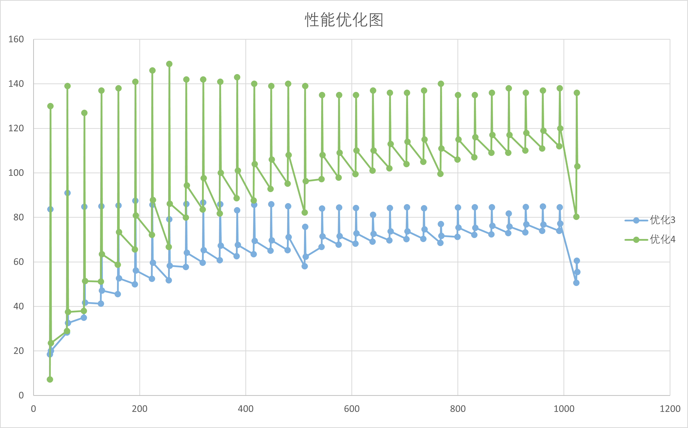
### sgemm-blocked-v2.c
1.观察sgemm-blocked-v1.c版本的优化图，发现矩阵规模在非整除边界条件下的处理由于引入了大量的标量运算，导致性能出现断层现象。
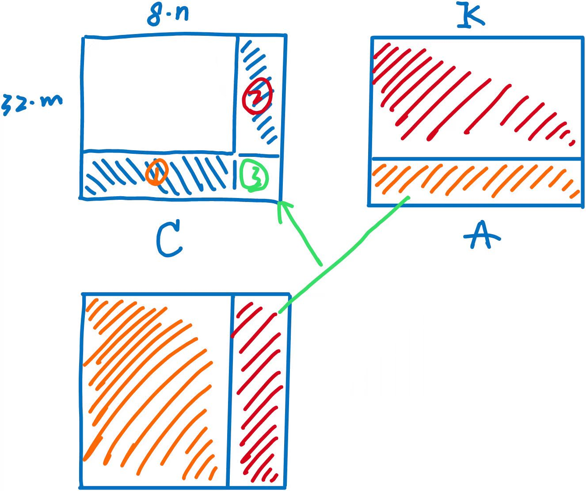
对此我将非32*8的边界部分化成3部分，分别进行对应优化处理，
(1)首先注意到对于区域②的优化是简单的，通过使用`j * k * m`次SIMD处理（利用AVX-512指令集）即可完成。
(2)而对于①区，注意到可以引入AVX2指令集一次性处理8个数据，恰好符合B、C的矩阵特征。故将B和C进行二次pack和unpack引入向量计算。
(3)对于③区，考虑到其矩阵规模较小，通过引入掩码的方式引入的花销并不大，因此为③区引入掩码形式的向量计算.
对应伪代码和性能优化如下：
```C++
static void do_block_optsta_old(int lda, int ldb, int ldc, int M, int N, int K, float* __restrict A, float* __restrict B, float* __restrict C) 
{
  // 每次处理8列
    /*for 外部j循环
        for K循环
            for jj循环：
              转置B并打包存储
        for i循环
            for jj循环：
              转置C并打包存储
        __m256指令向量计算
        ··· 
        unpack C
    */
}
static void do_block_opt(int lda, int ldb, int ldc, int M, int N, int K, float* __restrict A, float* __restrict B, float* __restrict C)
{
  for(int k = 0; k < K; ++k)
    for(int j = 0; j < N; ++j)
      // 寄存B
      for(; i <= M - 16; i += 16)
      // 利用AVX-512指令处理i
      if(i < M)
      {
        __mmask16 mask = (1 << (M-i)) - 1;
        __m512 a = _mm512_maskz_load_ps(mask, &A[i+k*lda]);
        __m512 c = _mm512_maskz_load_ps(mask, &C[i+j*ldc]);
        c = _mm512_fmadd_ps(a, _mm512_set1_ps(b), c);
        _mm512_mask_store_ps(&C[i+j*ldc], mask, c);
      }
}
```
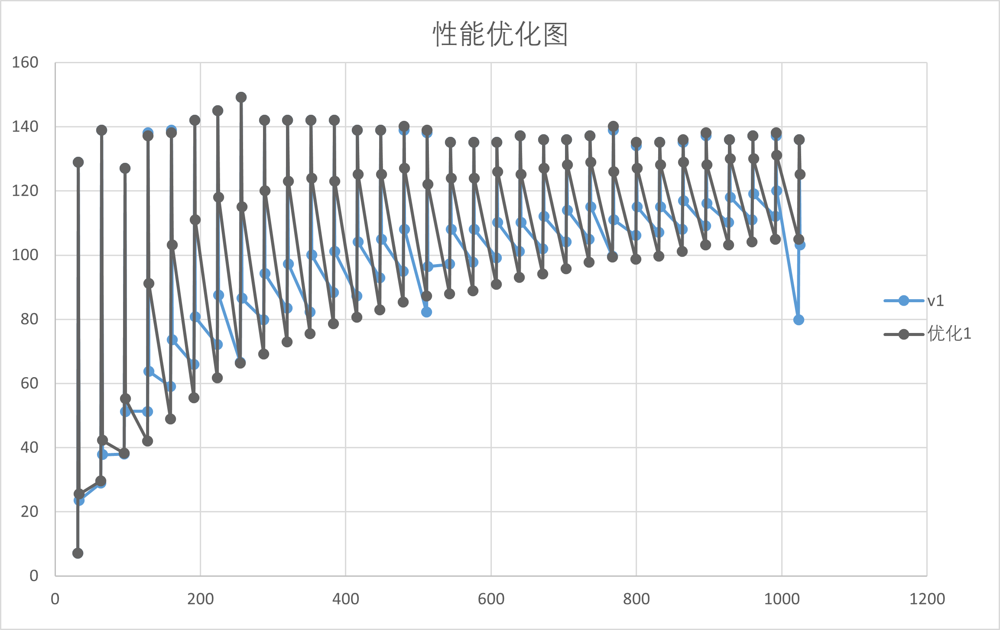
2.此时如385，513，1025大小的矩阵性能有了意料之中的提升，而对于383，511等大小的矩阵由于涉及大量非整数边界的处理，性能提升并不充分。通过`roofline`性能分析可知,此时对于①区和③区进行访存和计算优化仍是重要的。
以511规模为例，其中需要进行7次`31 * 64`和1次`31 * 56`的①区计算，由于使用AVX2进行计算，涉及转置操作，其复杂度为$O(n^2)$,且此处无法使用SIMD进行简化，因而打包C循环操作次数为`((8*i)*2)*n`,这对于计算密度无疑是致命的。因此我选择放弃了使用AVX2进行行主序方向的开发。尝试两种在上一步中提到过的方法：掩码计算和二次打包。
（1）通过掩码计算，得到的性能优化图如下：
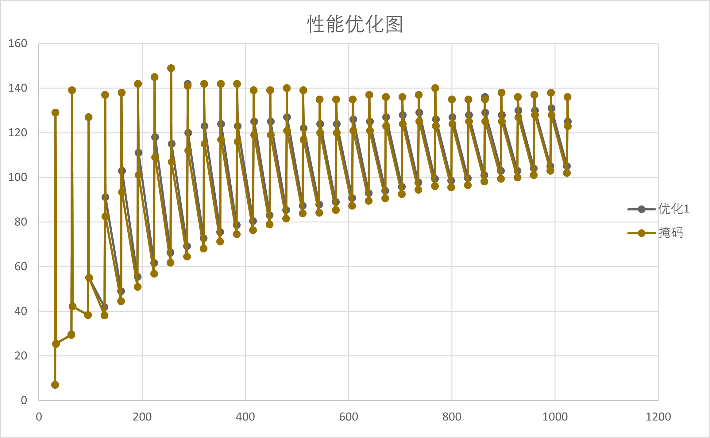
尽管此时对于掩码计算的原始设计较为粗糙，但是可发现其对于性能没有明显提升，故放弃掩码计算的进一步开发。
（2）对①区中的A矩阵和C矩阵进行打包，分别将其打包成`32*K`和`32*(8*n)`大小的矩阵，使用`do_block_avx32x8`的计算核心，总共经过`K*n`次循环计算和`(n*8)*2+K`次打包循环操作，其打包循环操作的复杂度为$O(n)$，循环效率提高。对③区则取n=1即可，得到的性能优化图如下：
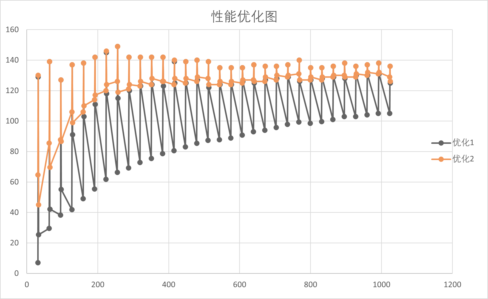
此时峰值性能和385，513，1025大小的矩阵性能没有发生明显变化，而383，511等大小的矩阵性能明显提高，保存对应版本为sgemm-blocked-v2.c
### sgemm-blocked-v3.c
1.对比此前v2版本与BLAS基准实现的性能：
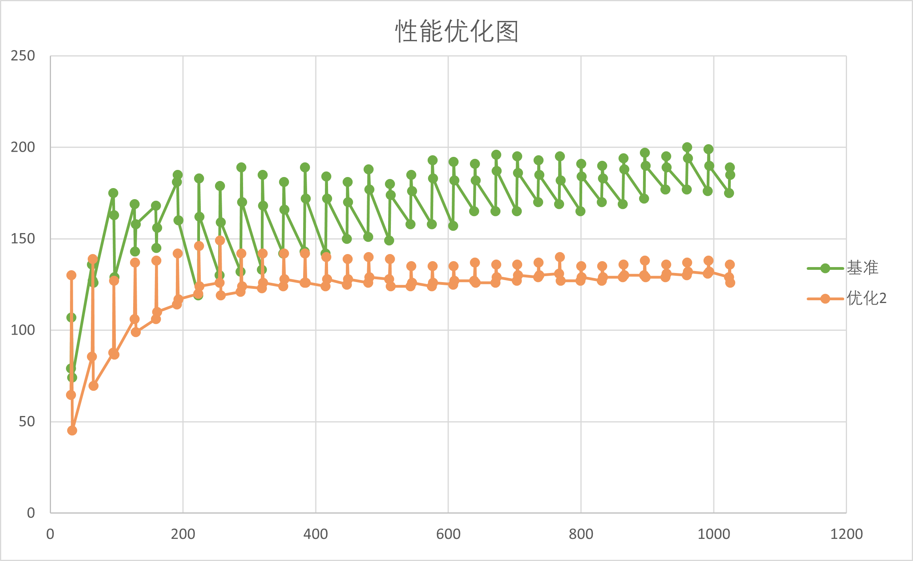
发现v2的性能走向和BLAS基准的性能走向在尾端有明显差异。考虑到在一级分块的过程中，我采用了`256 * 128`的大小，占据约L2 cache的10%，与论文中的要求有明显的差异，对L2 cache的利用率较低，且尤其当矩阵规模较大时，会导致较多次数的外循环，降低计算效率。因此我采用了`_mm_prefetch`显式预取和修改一级分块中M的大小，得到的一定的性能优化表现：
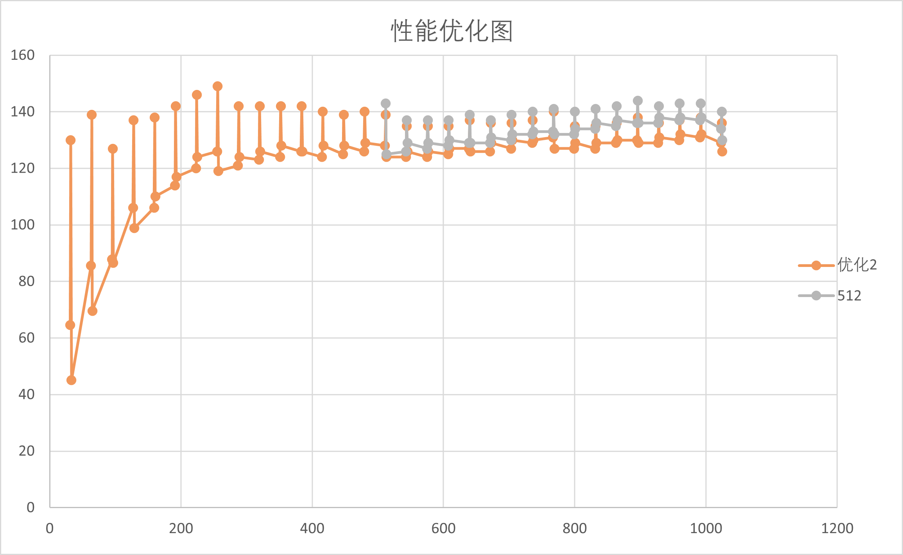
当lda>500时，取M=512，使得性能表现在矩阵规模较大时，有明显的上升趋势。据此，我将M分块调整为256，384，512，得到性能优化表现如下：
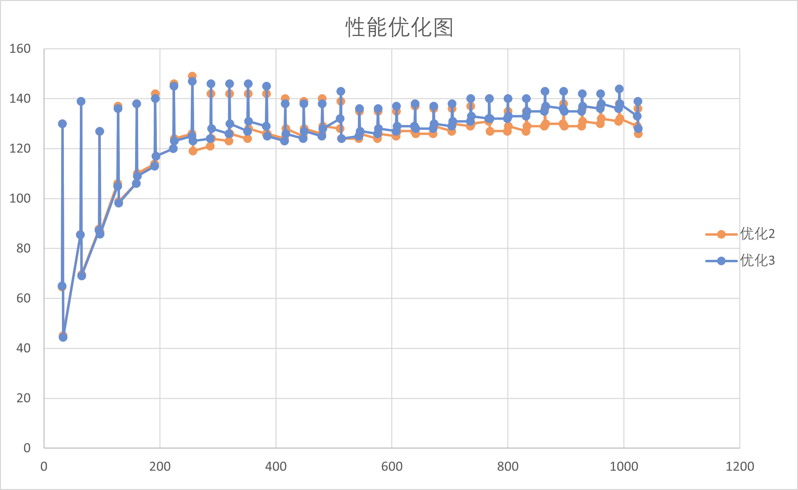

2.由于和BLAS性能相比，峰值性能仍有明显差异。考虑以512规模为例，共将A矩阵划分成4块，B矩阵32块，C矩阵8块，每次计算一块C，需要128次外部循环，这对于C的计算密度而言，显然较低。因此考虑设计`64*16`大小的计算核心，此时对于外部循环，只需要进行32次，提高了C的计算密度。由于寄存器限制，我采用了`do_block_avx64x4`的核，连续调用四次，性能表现有了明显提升，并保存为版本sgemm-blocked-v2.c：
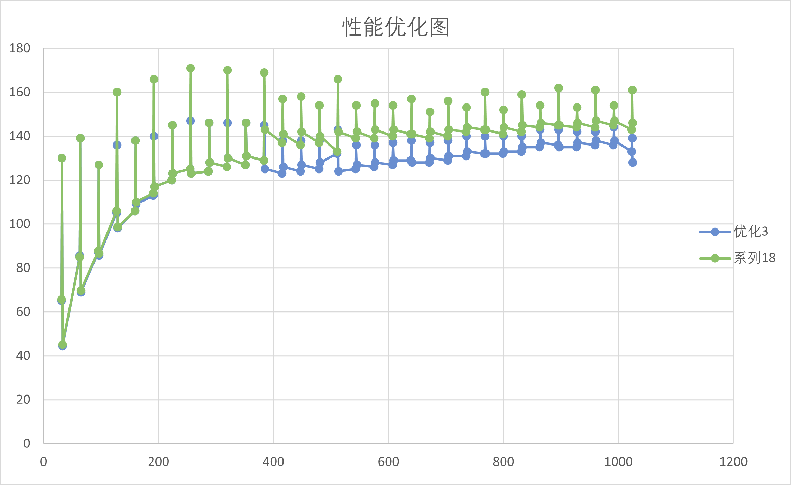

3.进一步，观察到在`roofline`性能分析过程中，Pack_Array也消耗了一定的时间，因此我采用掩码的形式将Pack_Array的计算核心全部转变为向量运算，使得只需进行`((FIRST_SIZE//16)+1)*SECOND_SIZE`次计算，增加了计算密度,对应优化表现如下：
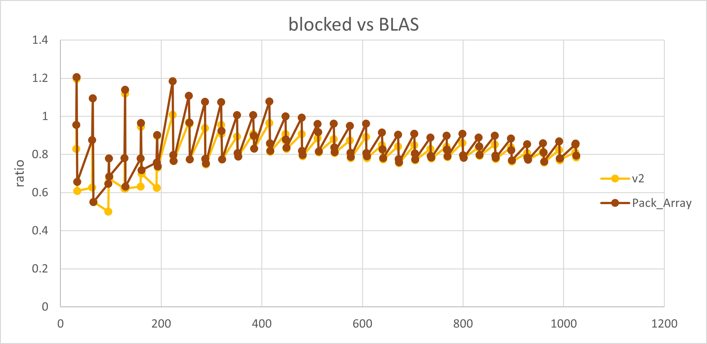

4.在此基础上，根据`roofline`模型，我对`do_block_optclo`函数进行了性能分析，由于在原本版本中需要进行`j*K`次外部循环，而如果按照①区和③区的处理方式进行打包时，则需要经历$O(n)$复杂度的外部循环，这在数据量巨大的情况下非常关键，因此，将该函数同样进行内部打包处理之后，微调代码结构，得到性能优化表现如下：
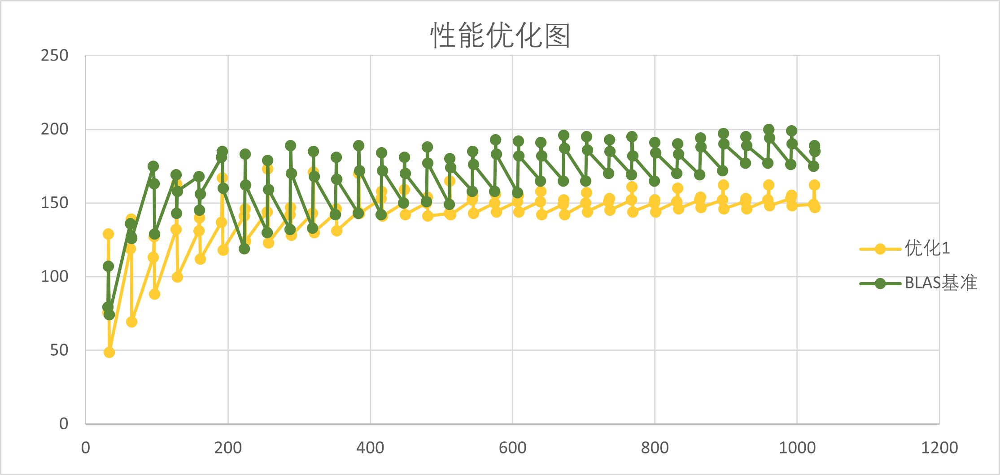

最终，经过进一步代码优化和结构微调，我虽仍发现在大规模矩阵上的表现并不好，并考虑到对于L2 cache的存储效率不达20%，但经过相同的分块打包和avx计算核的调试后，性能不增反降，这意味着在大规模矩阵的计算性能优化需要更清晰和精准的策略。但即便如此，我已确保Blocked优化大部分达到Blas基准的80%，甚至部分表现由于Blas基准表现，在规模较大的情况下，保证性能达到140GFlop/s,峰值性能达到173GFlop/s，最低性能由于受矩阵规模的影响，但也超过50GFlop/s。
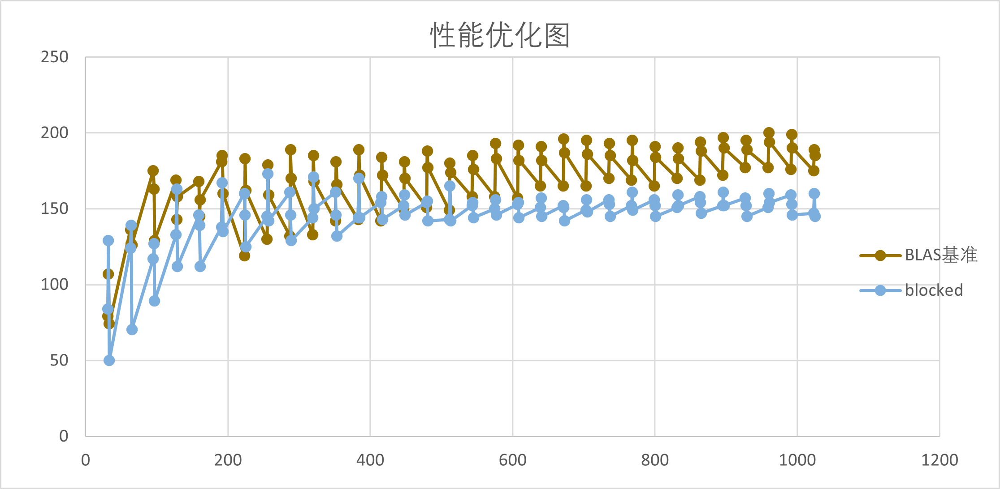
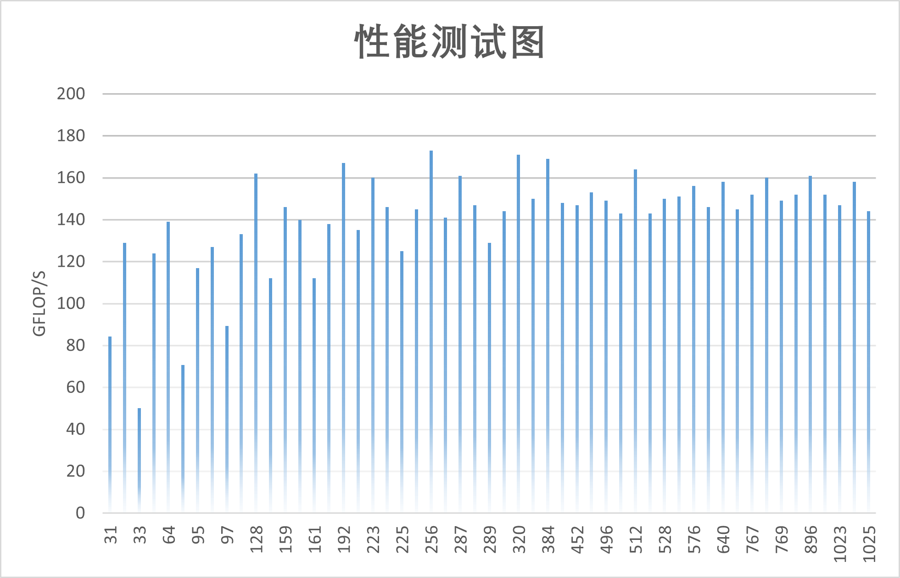


